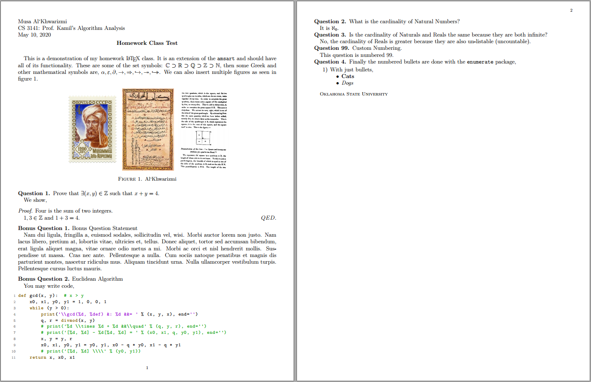

# Homework in Latex

You may get Latex [here](https://tug.org/texlive/) then place the class  and style files: [`homework.cls`](./src/homework.cls), [`hwlst.sty`](./src/hwlst.sty) and [`hwsymb.sty`](./src/hwsymb.sty) in the same directory as your `*.tex` files. A demo [hw.tex](./test/hw.tex) file is present in the repository that produces the following [pdf](./test/hw.pdf).

## License

`homework.cls, helst.sty, hwsymb.sty` are Latex classes and styles aimed towards people (particularly those in STEM) who want to do their homework in Latex.

Copyright (C) 2020  Ahmad Tashfeen

This program is free software: you can redistribute it and/or modify
it under the terms of the GNU General Public License as published by
the Free Software Foundation, either version 3 of the License, or
(at your option) any later version.

This program is distributed in the hope that it will be useful,
but WITHOUT ANY WARRANTY; without even the implied warranty of
MERCHANTABILITY or FITNESS FOR A PARTICULAR PURPOSE.  See the
GNU General Public License for more details.

You should have received a copy of the [GNU General Public License](COPYING)
along with this program.  If not, see <https://www.gnu.org/licenses/>.
